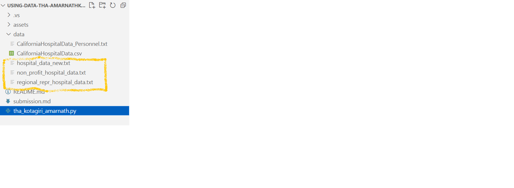
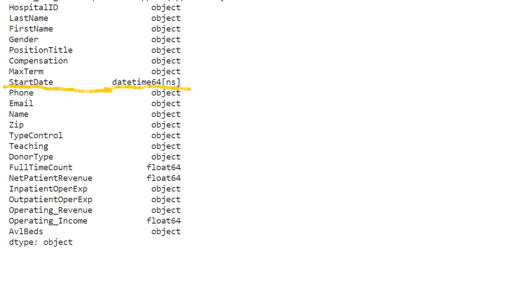
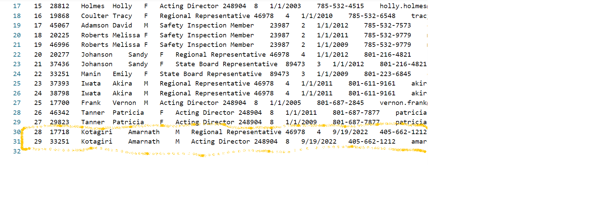
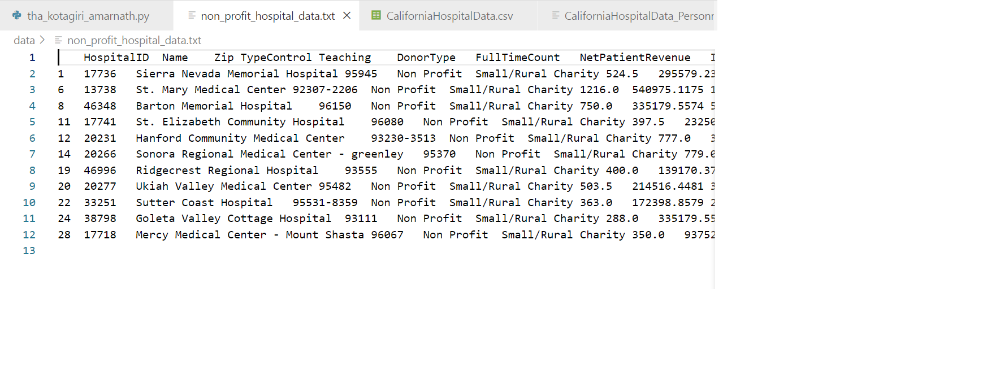
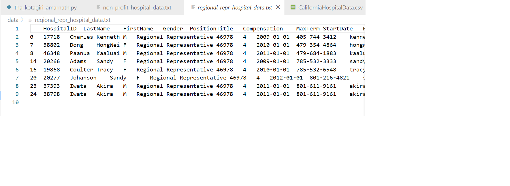

# Using Data THA
Below is the screenshot for Three new Data Files are created as per the Question

Below is the screenshot for Changing the Column Datatype to DateTime and Renaming some ColumnNames

Below is the screenshot for Inserting two new rows

Below is the screenshot for Non Profit Data

Below is the screenshot for Regional Representative Data

